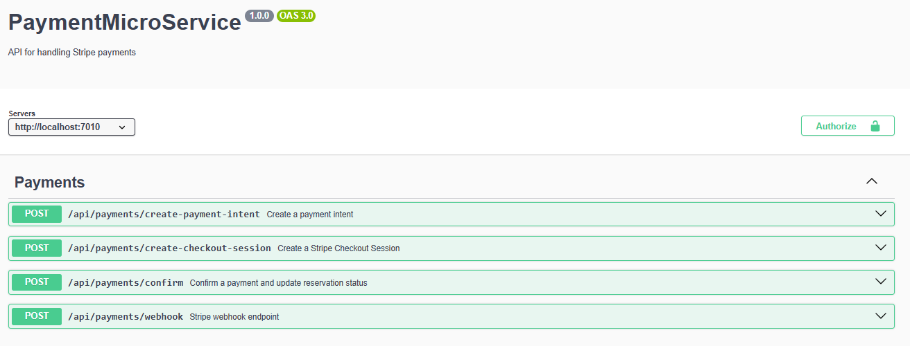
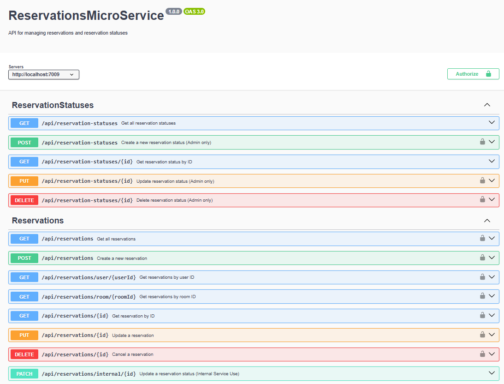
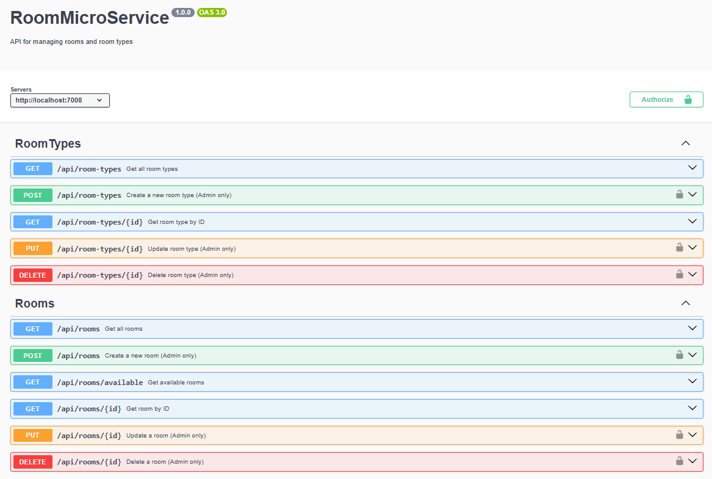
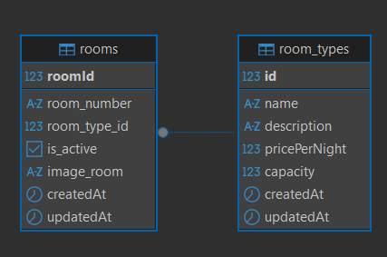
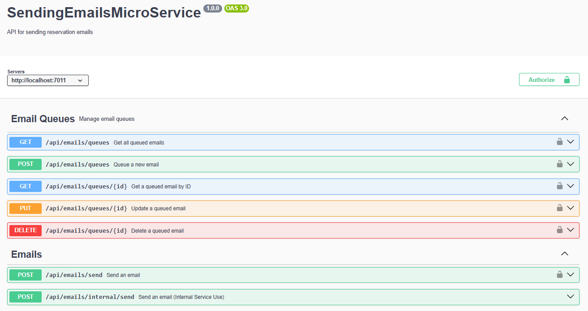
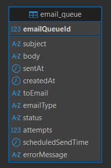
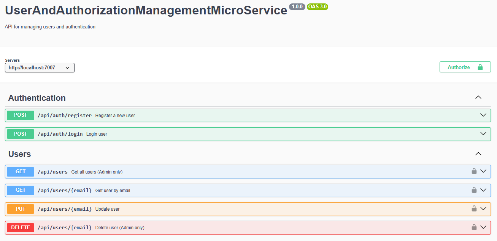
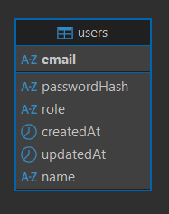

# RoomReservationMicroServicesApiNode

This project is a microservices API for a room booking system, developed in Node. It allows you to manage rooms, room types, bookings, payments with Stripe, email notifications, and user and authorization management.

## Features

- **Room Management**: Create, update, delete, and query rooms and room types.

- **Bookings**: Create, manage, and cancel room bookings.

- **Payments**: Integration with Stripe to process booking payments.

- **Email Notifications**: Service for sending confirmation emails and notifications.

- **User and Authorization Management**: User authentication and authorization with JWT.

- **Microservices Architecture**: Each functionality is separated into independent microservices.

- **Multiple Databases**: Support for SQL Server, MySQL, PostgreSQL, SQLite, and MongoDB.

- **API Documentation**: Swagger for interactive API documentation.

## Technologies Used

- **Runtime**: Node.js (v18+)
- **Language**: TypeScript
- **Framework**: Express.js
- **ORM**: TypeORM
- **Databases**: PostgreSQL (Primary), MySQL, SQL Server (MSSQL), SQLite, MongoDB
- **Authentication**: JSON Web Token (JWT) & BcryptJS
- **Payments**: Stripe API
- **Documentation**: Swagger (swagger-ui-express & swagger-jsdoc)
- **Validation**: class-validator & class-transformer
- **Logging**: Winston

## Requirements

- **Node.js**: Version 18.x or higher
- **npm**: Version 9.x or higher
- **Databases**: PostgreSQL (or any other supported by TypeORM as configured in `.env` files)
- **Stripe Account**: For processing payments (Secret Key required)

## Installation

1. Clone the repository:

   ```bash
   git clone <repository-url>
   cd RoomReservationMicroServicesApiNode
   ```

2. Install dependencies for all microservices:

   ```bash
   npm run install-all
   ```

3. Configure environment variables:
   Create a `.env` file in each microservice directory following the `.env.example` (if available) or standard TypeORM/Stripe/JWT configurations.

## Execution

To start all microservices simultaneously:

```bash
npm run start-services
```

This command runs `start-services.js`, which launches each service and opens their Swagger documentation in your default browser.

To run migrations for all services:

```bash
npm run migration:run
```

## Microservices and Endpoints

Each microservice runs on a specific port and has its own Swagger documentation:

- **UserAndAuthorizationManagementMicroService**: Port 3001
- **RoomMicroService**: Port 3002
- **ReservationsMicroService**: Port 3003
- **PaymentMicroService**: Port 3004
- **SendingEmailsMicroService**: Port 3005

### Authentication & Users (Port 3001)

- `POST /api/auth/register`: Register a new user.
- `POST /api/auth/login`: Login and receive JWT.
- `GET /api/users`: Get all users (Admin only).
- `GET /api/users/:email`: Get user by email.
- `PUT /api/users/:email`: Update user details.
- `DELETE /api/users/:email`: Delete user (Admin only).

### Room Management (Port 3002)

- `GET /api/rooms`: List all rooms.
- `GET /api/rooms/available`: List available rooms.
- `POST /api/rooms`: Create a room (Admin).
- `GET /api/room-types`: List all room types.
- `POST /api/room-types`: Create room type (Admin).

### Reservations (Port 3003)

- `GET /api/reservations`: List all reservations.
- `POST /api/reservations`: Create a new reservation.
- `GET /api/reservations/user/:userId`: List reservations for a user.
- `DELETE /api/reservations/:id`: Cancel a reservation.
- `GET /api/reservation-statuses`: List possible reservation statuses.

### Payments (Port 3004)

- `POST /api/payments/create-checkout-session`: Start a Stripe checkout session.
- `POST /api/payments/confirm`: Confirm payment completion.
- `POST /api/payments/webhook`: Stripe webhook handler.

### Email Notifications (Port 3005)

- `POST /api/emails/send`: Send a manual email (Admin).
- `GET /api/emails/queues`: List queued emails (Admin).
- `POST /api/emails/queues`: Manually queue an email.

## PaymentMicroService

```text
PaymentMicroService/
├── controllers/
├── dtos/
├── routes/
├── services/
├── utils/
├── index.ts
├── package.json
├── tsconfig.json
└── .env
```

<kbd>
  
</kbd> 

## ReservationsMicroService

```text
ReservationsMicroService/
├── config/
├── controllers/
├── dtos/
├── middleware/
├── migrations/
├── models/
├── routes/
├── services/
├── utils/
├── index.ts
├── run-migration.js
├── package.json
├── tsconfig.json
└── .env
```

<kbd>
  
</kbd>  

<kbd>
  
</kbd>  

## RoomMicroService

```text
RoomMicroService/
├── config/
├── controllers/
├── dtos/
├── middleware/
├── migrations/
├── models/
├── routes/
├── services/
├── utils/
├── index.ts
├── package.json
├── tsconfig.json
└── .env
```

<kbd>
  
</kbd>  

<kbd>
  
</kbd>  

## SendEmailsMicroService

```text
SendEmailsMicroService/
├── config/
├── controllers/
├── dtos/
├── middleware/
├── migrations/
├── models/
├── routes/
├── services/
├── utils/
├── index.ts
├── package.json
├── tsconfig.json
└── .env
```

<kbd>
  
</kbd>  

<kbd>
  
</kbd>  

## UserAndAuthorizationManagementMicroService

```text
UserAndAuthorizationManagementMicroService/
├── config/
├── controllers/
├── dtos/
├── middleware/
├── migrations/
├── models/
├── routes/
├── services/
├── utils/
├── index.ts
├── package.json
├── tsconfig.json
└── .env
```

<kbd>
  
</kbd>  

<kbd>
  
</kbd>  

[DeepWiki moraisLuismNet/RoomReservationMicroServicesApiNode](https://deepwiki.com/moraisLuismNet/RoomReservationMicroServicesApiNode)
